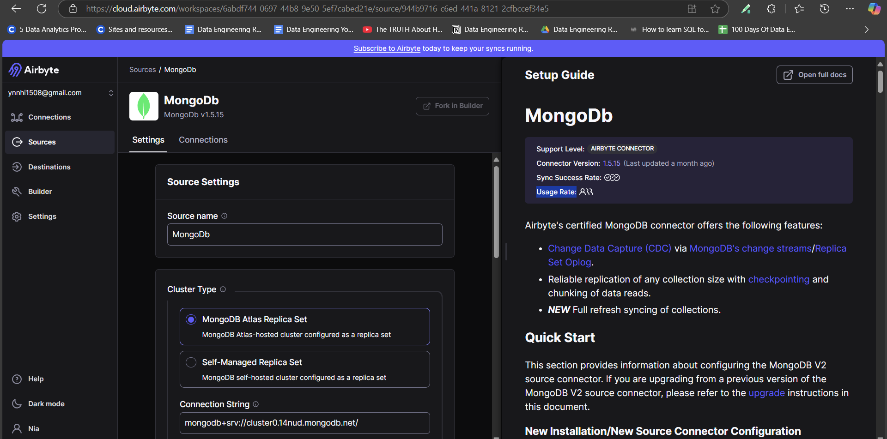
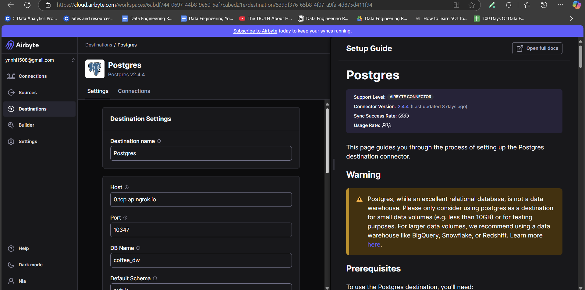
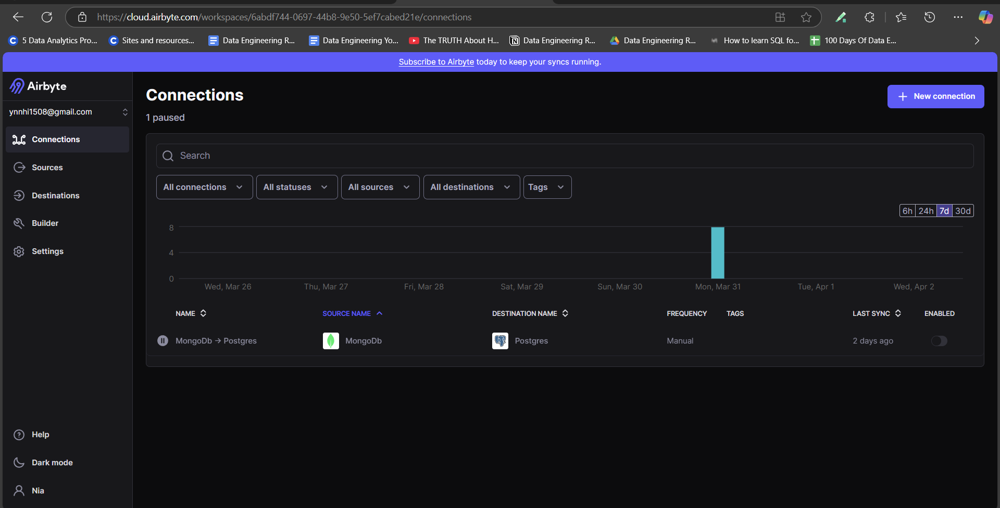

# ***⏳ Batch Pipeline***
## 1. Setup Airbyte connection
You can create an Airbyte account using the link in the [Prerequisites](overview.md#local-setup) section.

Once you’ve created your account, you can set up connections between the source and destination databases (in this case, MongoDB and PostgreSQL). Each database setup has a tutorial alongside the configuration, so you don’t need to worry about that.<br>



---

## 2. DBT Setup
We mount all the things related to DBT container in folder `dbt_project/`. We have our only DBT project `coffee_dw`. <br>
Here is a brief overview of the necessary configuration files required to run DBT:

1. `profile.yml` 
    - This file is used to define the connection configurations for DBT to connect to your database (like PostgreSQL, Snowflake, etc.). It contains important information such as the database credentials, host, schema, and other connection settings.
    - Visit this <a href="https://docs.getdbt.com/docs/core/connect-data-platform/profiles.yml" target="_blank">link</a> for more details.
    ```py
    coffee_dw:
    target: postgres
    outputs:
    postgres:
      type: postgres
      host: host.docker.internal
      user: postgres
      password: "{{ env_var('POSTGRES_PASSWORD') }}"
      port: 5432
      dbname: coffee_dw
      schema: dbo
      threads: 8
    ```
2. `dbt_project.yml`
    - This file is the main configuration file for your DBT project. It defines the project name, version, models, and other settings that guide the execution of DBT commands.
    - Visit this <a href="https://docs.getdbt.com/reference/dbt_project.yml" target="_blank">link</a> for more details.
3. `seeds\`
    - The `seeds/` folder contains CSV files that can be loaded into the database as tables. These are static data sets that you can use for reference data, small lookup tables, or small sample datasets that don’t change frequently.
    - In addition to the `CSV file`, you can create a corresponding `YAML file` to configure column types, default values, and other settings for the table being created from the CSV file.
    - Visit this <a href="https://docs.getdbt.com/docs/build/seeds" target="_blank">link</a> for more informations about properties or commands.
    ```
    id,name,modified_date
    1,Coffee,2025-03-17 13:08:30
    2,Tea,2025-03-17 13:08:30
    3,Yogurt,2025-03-17 13:08:30
    4,Juice,2025-03-17 13:08:30
    5,Cake,2025-03-17 13:08:30
    ```
    ```
    version: 2

    seeds:
    - name: product_category
        config:
        schema: raw
        column_types:
            id: integer
            name: varchar
            modified_date: timestamp
    ```

4. `models\`
    - The `models/` folder is where you define your DBT models, which are SQL files that define transformations in your data warehouse. These models are run when you execute the `dbt run` command and typically produce tables or views in your data warehouse.
    - Visit this <a href="https://docs.getdbt.com/docs/build/sql-models" target="_blank">link</a> for more informations about SQL models.

## 3. Run the Batch Pipeline
### Execution Overview 🎬
Before running, here’s a quick demo of the batch pipeline in action:

📽️

{: style='width: 100%'}

### DBT models


#### Staging
- `source_transactions.yml` defines the data source from the `transactions` table in the public schema of the database, which serves as the `raw data` source for our pipeline.
```
version: 2

sources:
  - name: raw
    schema: public
    tables:
      - name: transactions
        description: "Coffee sales table"
        columns:
          - name: _id
            tests:
              - not_null
              - unique
```
---

-  `raw data` looks like this:
    ```
    {
    "_id": "67da8f08fbbecd9533bcd1e3",
    "timestamp": "2025-03-19T16:31:52.161709",
    "store_id": 4,
    "total_amount": 150000,
    "payment_method": 2,
    "currency": "VND",
    "items": [
        {
        "product_id": "C05",
        "name": "Matcha Cheesecake",
        "category": "Cake",
        "quantity": 3,
        "subtotal": 150000
        }
    ]
    }
    ```

- `stg_sales.sql` cleans and transforms the raw data from transactions into a `staging table`, which will be further processed in the next steps.<br>
- `materialized='incremental'`: This ensures that only `new data is updated` rather than rebuilding the entire table. Visit <a href="https://docs.getdbt.com/docs/build/incremental-models" target="_blank">dbt incremental models</a> for more details.
- The `items` field is an `array` in the document. To extract each item as a separate row in PostgreSQL, we use the `jsonb_array_elements` function. This allows us to break down the array into individual product details, making it easier to query and process each item separately in the transaction.
```py
{{ config(
    materialized='incremental',
    unique_key='sales_id'
) }}

WITH stg_sales AS (
    SELECT 
        _id AS sales_id,
        timestamp,
        store_id,
        payment_method,
        jsonb_array_elements(items) AS item
    FROM {{ source('raw', 'transactions') }}

    
    WHERE timestamp > (SELECT MAX(timestamp) FROM {{ this }})
    
)

SELECT
    stg_sales.sales_id,
    stg_sales.timestamp,
    stg_sales.store_id::INTEGER,
    stg_sales.payment_method::INTEGER AS payment_method_id,
    (item->>'product_id') AS product_id,
    (item->>'quantity')::INTEGER AS quantity,
    (item->>'subtotal')::INTEGER AS subtotal
FROM stg_sales
```
---

#### Marts
- In the `dimensions/` folder, you will have models like `dim_product`, `dim_store`, and `dim_payment`. These models represent `dimension tables` in the Data Warehouse, storing descriptive `attributes` of key entities like products, stores, and payment methods. These tables are used to enrich the data for analysis, providing context to the events stored in the fact tables.
- In the `fact/` folder, you will have models like `fact_sales`, contains transactional data such as sales, quantity, timestamp, and revenue, which are linked to the corresponding dimensions (product, store, payment method). The sales_key is a unique identifier for each transaction, generated using a combination of surrogate keys for the product, store, and payment method.
```py
{{ config(
    materialized='incremental',
    unique_key='sales_key'
) }}

WITH stg_sales AS (
    SELECT *
    FROM {{ ref('stg_sales') }}

    
    WHERE timestamp > (SELECT MAX(timestamp) FROM {{ this }})
    
)

SELECT
    MOD(ABS(CAST('x' || LEFT(MD5(CONCAT(stg_sales.sales_id, stg_sales.product_id)), 15) AS BIT(64))::BIGINT), 10000000000) AS sales_key,
    {{ dbt_utils.generate_surrogate_key(['stg_sales.store_id']) }} AS store_key,
    {{ dbt_utils.generate_surrogate_key(['stg_sales.product_id']) }} AS product_key,
    {{ dbt_utils.generate_surrogate_key(['stg_sales.payment_method_id']) }} AS payment_method_key,
    stg_sales.sales_id,
    stg_sales.timestamp,
    stg_sales.quantity,
    stg_sales.subtotal AS revenue
FROM stg_sales
```

All `YAML files` in the models directory are used for `data quality` checks and to define `relationships` between different models. These files help ensure that the data meets the expected standards and integrity constraints, such as non-null values, uniqueness, and correct data types, while also establishing relationships between tables for accurate data modeling.<br>
```py
version: 2

models:
  - name: fact_sales
    columns:
      - name: sales_key
        description: The surrogate key of the sale
        tests:
          - not_null
          - unique

      - name: store_key
        description: The foreign key of the store 
        tests:
          - not_null
          - relationships:
              to: ref('dim_store')
              field: store_key

      - name: product_key
        description: The foreign key of the product
        tests:
          - not_null
          - relationships:
              to: ref('dim_product')
              field: product_key

      - name: payment_method_key
        description: The foreign key of the payment method
        tests:
          - not_null
          - relationships:
              to: ref('dim_payment')
              field: payment_method_key

      - name: sales_id
        description: The natural key of the sale
        tests: 
          - not_null

      - name: timestamp
        description: The timestamp of the sale

      - name: quantity
        description: The quantity of the product
        tests:
          - not_null

      - name: revenue
        description: The revenue obtained by multiplying the price and quantity
        tests:
          - not_null  
``` 