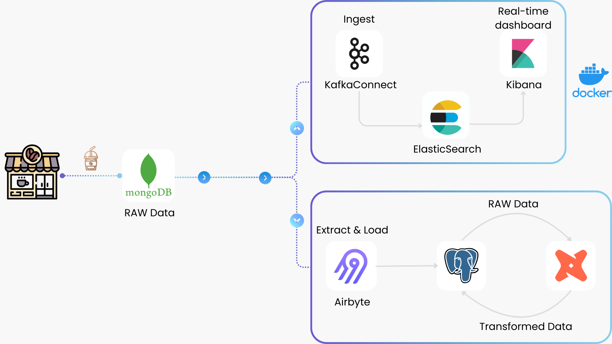

# ***PROJECT EVOLUTION***

This document outlines the evolution of the Coffee Sales Data Pipeline project. It highlights key architectural, technological, and business logic changes across major versions. This helps track improvements over time and maintain clear context for future development.

---

#### v1.0 - 2025.04 (Initial Release)

🎯 Overview 
A basic data pipeline to simulate and analyze coffee shop sales.

📦 Architecture 

Data Source

- `MongoDB` stores transactional data (coffee orders).

Real-time Processing

- `Kafka Connect` captures changes from MongoDB.
- `ElasticSearch` stores real-time events.
- `Kibana` visualizes operational metrics and trends.

Batch Processing

- `Airbyte` extracts data from MongoDB into PostgreSQL (raw layer).
- `PostgreSQL` acts as the data warehouse for storing structured data.
- `DBT` transforms raw data into analytics-ready models and ensures data quality through testing.

Load Strategy

- Full load only; no incremental load implemented yet.

✅ Benefits

- Easy setup.
- Low code.
- Schema flexibility, easy to scale with MongoDB.
- Airbyte supports schema changes and multi-source ingestion.

⚠️ Limitations

- Only supports full-load batch processing; no incremental logic.
- Does not implement Slowly Changing Dimension (SCD) handling.
- Lacks real-time business logic (e.g., alerting, rule-based processing).
- Orchestration tools are not integrated.
- Logging and monitoring are not yet implemented.
---

#### v1.1 - 2025.06

🎯 Overview 
Upgraded to support real-time business rules, historical data tracking, and scalable lakehouse design.

📦 Architecture 

Data Source

- `MySQL` stores both transactional and attribute data.

Real-time Processing

- Continues to use `Kafka Connect` for Change Data Capture (CDC).  
- Adds `Kafka Consumers` to handle real-time business logic.  
- Uses `Redis` for low-latency lookups and caching.
- Uses `Prometheus` and `Grafana` to observe Kafka health and trigger alerts.

Batch Processing

- Adopts a Lakehouse and Medallion Architecture.  
- `Spark` handles data ingestion, transformation, and data quality checks.  
- `Airflow` is used for orchestration and job scheduling.

Load Strategy

- Supports incremental load.

✅ Benefits

- Incremental load implemented.  
- Slowly Changing Dimension (Type 2) supported.  
- Real-time business rules applied during stream processing.  
- Monitoring, alerting and logging integrated.  
- Full orchestration with Airflow.

⚠️ Limitations

- Not yet serving layer (e.g., SQL engine or BI tool) for DA/BA usage.

---

Last updated: 16, June 2025
