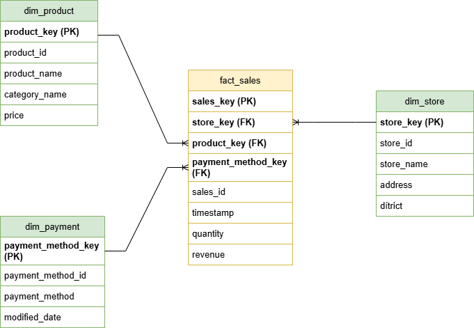
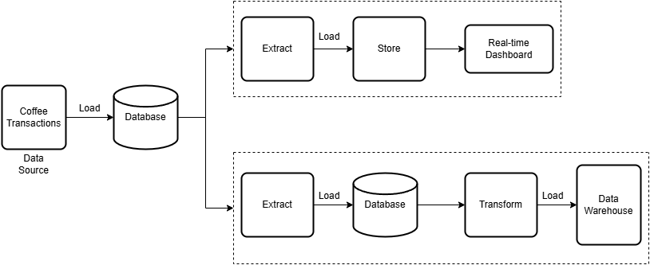
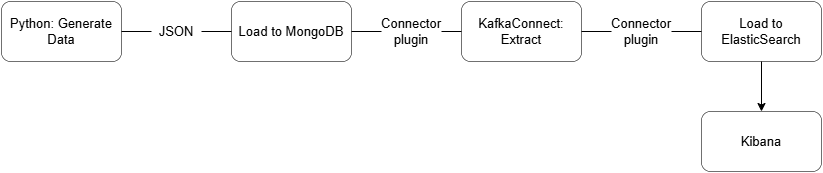
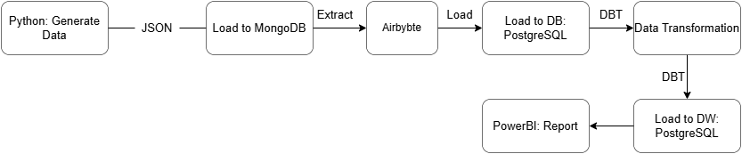
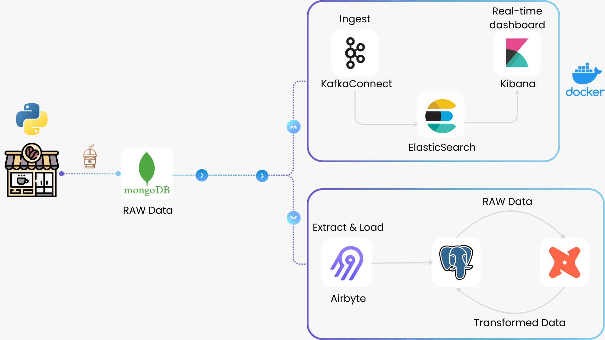
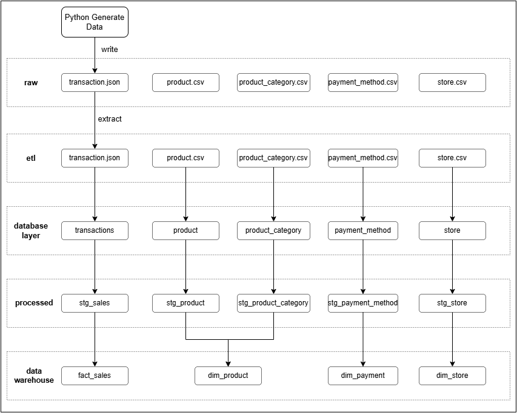

# ***📝 DOCUMENTATION***

## I. Design
### 1. Business Problem (Simulation)
This project simulates transaction data from a coffee shop. The data used includes:

- `transactions`: Raw transactions data generated for the coffee shop.
- `product`:The list of products that are currently being sold in the coffee shops.
- `store`: The different branches or locations of the coffee shop
- `payment_method`: The payment method used when ordering.

### 2. Data Source
The data is divided into several CSV files and used as follows:

1. `product.csv`: A list of products sold in the coffee shop.  
      - product_id: Unique ID of the product  
      - name: Name of the product  
      - category_id: The category ID that the product belongs to
      - price: The price of the product
2. `product_category.csv`: The category of the product.
      - id: Unique ID for each product category
      - name: Name of the product category
      - modified_date: The date the category data was last updated
3. `store.csv`: The branches of the coffee shop.
      - id: Unique ID for each coffee shop location
      - name: Name of the coffee shop branch
      - address: The address of the coffee shop
      - district: The district where the coffee shop is located
4. `payment_method.csv`: The payment methods supported by the coffee shop
      - id: Unique ID for each payment method
      - method: The name of the payment method (e.g., Cash, Credit Card, etc.)
      - modified_date: The date when the payment method data was last updated.
5. `transactions`: This JSON data is generated automatically via a Python script. It includes detailed information about the transactions and loaded into MongoDB.
      - timestamp: The date and time of the transaction
      - store_id: The ID of the store where the transaction took place
      - total_amount: The total amount of the transaction
      - payment_method: The payment method used for the transaction
      - currency: The currency of the transaction
      - items: An array of the products sold during the transaction, where each item contains
         - product_id: Unique ID of the product
         - name: Name of the product
         - category: Category name of the product
         - quantity: The quantity of the product sold
         - subtotal: The total amount for that product (price × quantity)

### 3. Business Requirements
1. Real-time Analysis: Analyze transactions in real-time to monitor trends
      - Identify the busiest times during the day to optimize staffing and inventory.
      - Real-time tracking of the number of products sold, revenue, and number of bills.
      - Monitor the most frequently used payment methods to understand customer preferences.
      - Monitor which branch of the coffee shop generates the most revenue.

2. Daily & Weekly Analysis: Generate comprehensive daily and weekly reports to summarize sales performance and trends.
      - Daily Sales Summary: Total sales and transaction volume for each store.
      - Product Sales Breakdown: A report detailing the performance of each product and its category.
      - Store Performance: Compare sales performance across different branches to identify high-performing stores.

### 4. Database Design to store raw data
1. `transactions`: Raw transactions coffee data that loaded into PostgreSQL from MongoDB
      - _id: Unique ID of each transaction generated form source database (in this case MongoDB)
      - timestamp: The date and time of the transaction     
      - store_id:  Unique ID of the store
      - total_amount: The total amount of the transaction
      - payment_method: The payment method used for the transaction
      - currency: The currency of the transaction
      - items: An array of the products sold during the transaction, where each item contains
         - product_id: Unique ID of the product
         - name: Name of the product
         - category: Category name of the product     
         - quantity: The quantity of the product sold
         - subtotal: The total amount for that product (price × quantity)
2. `dbo_raw.product`: Loaded from `product.csv`
      - product_id
      - name
      - category_id
      - price
3. `dbo_raw.product_category`: Loaded from `product_category.csv`
      - id
      - name
      - modified_date
4. `dbo_raw.payment_method`: Loaded from `payment_method.csv`
      - id
      - method
      - modified_date
5. `dbo_raw.store`: Loaded from `store.csv`
      - id
      - name
      - address
      - district

### 5. Data Warehouse
In the data warehouse, we structure data into **staging tables**, **dimension tables**, and **fact tables** to support analytical queries efficiently.

#### Staging Tables
Staging tables contain transformed data, preparing it for fact and dimension tables. The table `stg_sales` reads data from the source system (PostgreSQL in this case) and transforms it. For example, in the raw `transactions` table, the `items` column is stored as an array. We explode it into multiple rows to make analysis easier.

- `stg_sales`
      - sales_id: The natural key of the transaction (renamed from `_id` from source data)
      - timestamp: The date and time of the transaction
      - store_id: The natural key of the store
      - payment_method_id: The natural key of the payment method
      - product_id: The natural key of the product
      - quantity: The quantity of the product sold
      - subtotal: The total amount for that product (price × quantity)

#### Dimension Tables
Dimension tables store attributes of key entities. In this project, we have three dimension tables: `dim_product`, `dim_store`, and `dim_payment`.

1. `dim_product`
      - product_key: Surrogate key of the product
      - product_id: The natural key of the product (from `dbo_raw.product`)
      - product_name: Name of the product
      - category_name: Category that the product belongs to (from `dbo_raw.product_category`)
      - price: Price of the product
2. `dim_store`
      - store_key: Surrogate key of the store
      - store_id: The natural key of the store (from `dbo_raw.store`)
      - store_name: Name of the store
      - address: Address of the store
      - district: District where the coffee shop is located
3. `dim_payment`
      - payment_method_key: Surrogate key of the payment method
      - payment_method_id: The natural key of payment method (from `dbo_raw.payment_method`)
      - payment_method: Name of the payment method
      - modified_date: The date when the payment method data was last updated

#### Fact Tables
Fact tables store transactional data, linking to dimension tables via foreign keys. In this project, we have one fact table: `fact_sales`

- `fact_sales`
      - sales_key: Unique identifier for each row, generated using a combination of sales_id and product_id
      - store_key: Foreign key referencing `dim_store`
      - product_key: Foreign key referencing `dim_product`
      - payment_method_key: Foreign key referencing `dim_payment`
      - sales_id: The natural key of the sale (from raw data `transactions`)
      - timestamp: The date and time of the transaction
      - quantity: The quantity of the product sold
      - revenue: The total amount for that product (renamed from `subtotal`)

The following diagram illustrates the relationship between the dimension and fact tables mentioned above: 

### 6. ELT Design
#### ELT Diagram

#### Task Flow
1. Streaming Flow

2. Batch Flow

#### Tech Selection

1. Streaming Pipeline
      - `KafkaConnect`
         - Enables seamless data integration between systems without requiring custom code—just create a JSON configuration file.
         - Supports CDC (Change Data Capture), allowing real-time tracking of data changes from source databases (e.g., MongoDB) and streaming them directly into Kafka before loading to the destination.
      - `ElasticSearch` & `Kibana`
         - A powerful real-time search and analytics engine optimized for transactional and log data, making it ideal for real-time analysis in a coffee shop.
         - Kibana provides intuitive data visualization, allowing users to build real-time dashboards in Elasticsearch without coding.

2. Batch Pipeline
      - `Airbyte`
         - A low-code data integration tool that simplifies extracting and loading data across systems.
         - Easy to configure connections between various data sources and destinations.
         - Automatically applies schema mapping when transferring data from NoSQL (e.g., MongoDB) to SQL (PostgreSQL).
      - `PostgreSQL` & `DBT`
         - PostgreSQL serves as the data warehouse, providing a structured environment for data transformation and analysis.
         - DBT (Data Build Tool) is used for transforming raw data into meaningful insights using SQL-based modeling.
         - DBT also supports data quality checks, including not null, unique, and referential integrity constraints to ensure clean and reliable data.

#### Data Flow

## II. [Deployment](overview.md)

