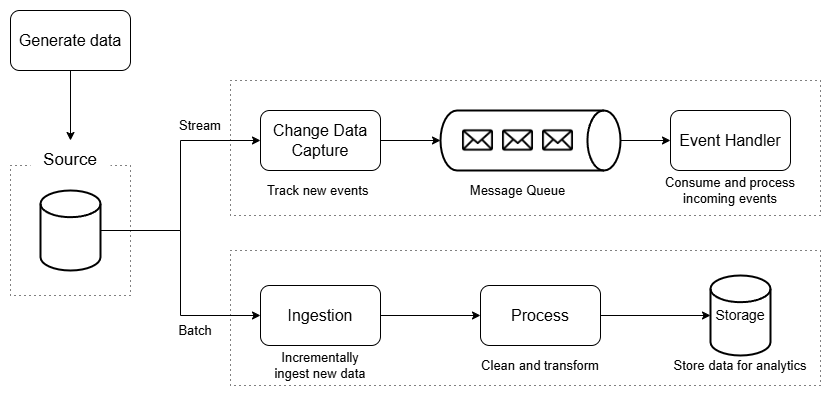
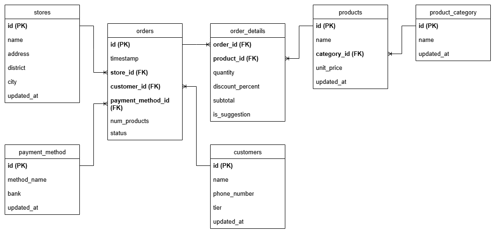
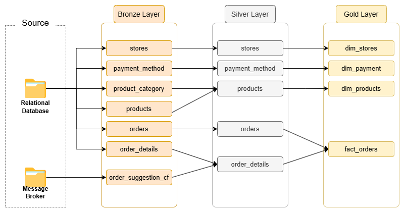
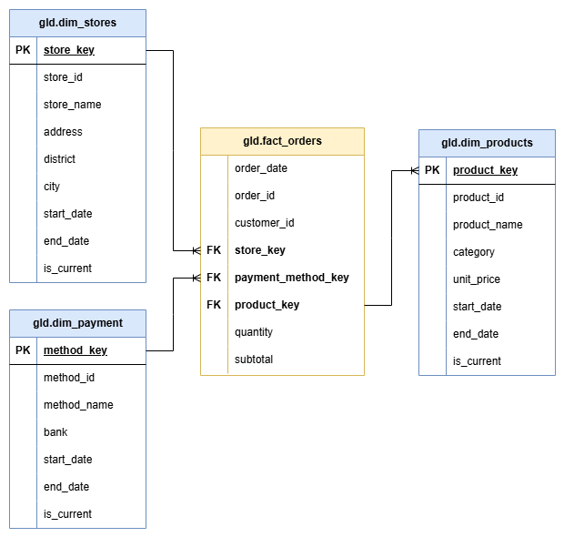
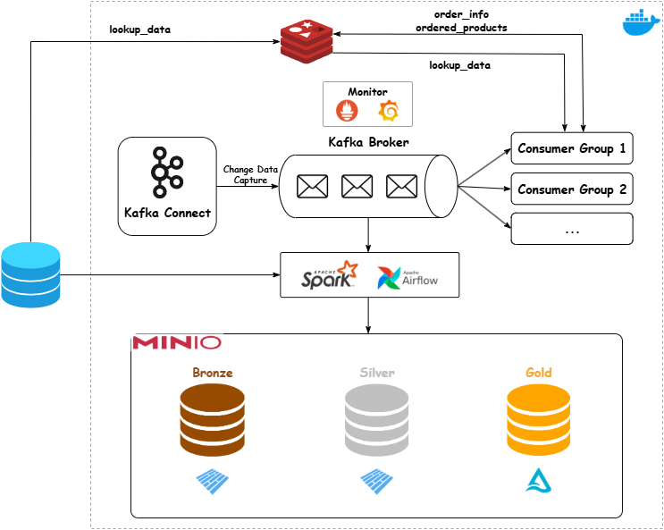

# ***📝 DOCUMENTATION***

## I. Design
### 1. Project Overview
This project simulates a data system for a coffee shop chain with two primary goals:

- **Real-time product suggestions** based on new customer orders
- **Daily batch processing** for analytics-ready data

It is designed to strike a balance between *low-latency business needs* and *scalable analytical workloads*, using a hybrid architecture that includes both streaming and batch components.

The system processes an average of **~17 events per second** (i.e., over **1000 order item events per minute**).

### 2. Business Requirements
##### Real-Time: Product Suggestion
When a new order is placed, the system should evaluate whether it qualifies for a product suggestion. The following conditions must be met:

- The payment method is *bank transfer*, and the bank is *ACB*
- The customer is a *diamond-tier member*

If all conditions are met, a product with a special discount is suggested — different from those already ordered. The condition check and product suggestion must be performed with minimal latency, as the process is expected to occur **almost instantly**. We will assume that all product suggestions are accepted by customers.

##### Batch: Daily Analytics Preparation
Each day, raw data is processed to support reporting and dashboarding. This includes:

- Ingest: Load new data from MySQL into the lakehouse
- Clean: Validate and transform the data
- Store: Persist structured, queryable datasets for downstream tools

### 3. Data Source
The data is divided into several CSV files and used as follows:

1. `product.csv`: A list of products sold in the coffee shop.  
	- id: Unique ID of the product  
	- name: Name of the product  
	- category_id: ID of the category this product belongs to
	- unit_price: The price of the product
	- updated_at: Timestamp of the last update to this product’s data
2. `product_category.csv`: The category of the product.
	- id: Unique ID for each product category
	- name: Name of the category
	- updated_at: Timestamp of the last update to this category’s data
3. `store.csv`: The branches of the coffee shop.
	- id: Unique ID for each coffee shop location
	- name: Name of the coffee shop branch
	- address: The address of the coffee shop
	- district: The district where the branch is located
	- city: The city that the branch is located.
	- updated_at: Timestamp of the last update to this store’s data.
4. `payment_method.csv`: The payment methods supported by the coffee shop
	- id: Unique ID for each payment method
	- method_name: The name of the payment method (e.g., Cash, Credit Card, etc.)
	- bank: Bank associated with the method (used for bank transfer only).
	- updated_at: The date when the payment method data was last updated.
5. `customers.csv`: List of customers.
	- id: Unique identifier for the customer.
	- name: The name of customer.
	- phone_number: Customer’s phone number.
	- tier: Customer membership level
	- updated_at: Timestamp of the last update to this customer’s data.
6. `orders`: This data is generated automatically via a Python script. It includes detailed information about the orders info and loaded into MySQL.
	- id: Unique ID for each order.
	- timestamp: Date and time when the order was placed.
	- store_id: The ID of the store where the order took place.
	- payment_method_id: The payment method used for the order.
	- customer_id: Customer who orders.
7. `order_details`: Auto-generated data representing products in each order (loaded into MySQL)
	- order_id: Identifier linking to the corresponding order.
	- product_id: ID of the purchased product.
	- quantity: Quantity of the product purchased.
	- discount_percent: Discount applied to this product (used in business logic). 
	- subtotal: Total price for this product (unit_price × quantity)
	- is_suggestion: Indicates whether this product was suggested (used in business logic).

### 4. Architecture at a Glance

The system separates responsibilities into two pipelines:

- Real-time pipeline: Handles event-driven product suggestion logic upon new orders
- Batch pipeline: Periodically transforms and stores data into the Lakehouse for analytics

### 5. MySQL: Transactional Landing Zone
MySQL is used as the initial data store for real-time order generation, chosen for its:

- Compatibility with CDC tools like Kafka Connect
- Support for ACID transactions
- Easy integration with Python-based data generators

This layer includes core tables such as `orders`, `order_details`, and reference tables like `products`, `stores`, `payment_methods`, etc.,

The ER diagram below illustrates the relationships between the core tables:

### 6. Lakehouse Architecture
In the lakehouse, we structure data using the *Medallion Architecture*:

- **Bronze**: raw data ingested from source systems
- **Silver**: cleaned, transformed and joined data
- **Gold**: aggregated and business-consumable data for dashboarding and analytics

#### Data Model in Gold Layer

#### Gold Layer Data Catalog
##### gld.dim_products
Provides information about the products and their attributes.

| Column Name    | Data Type | Description                                                                 |
|----------------|-----------|-----------------------------------------------------------------------------|
| product_key    | int       | Surrogate key for the product (unique per version for SCD2 tracking).       |
| product_id     | string    | Natural/business key from the original product source.                      |
| product_name   | string    | Name of the product.                                                        |
| category       | string    | Category that the product belongs to.                                       |
| unit_price     | int       | Price per unit of the product.                                              |
| start_date     | date      | Date when this version of the product record became valid.                  |
| end_date       | date      | Date when this version stopped being valid (null if current).              |
| is_current     | boolean   | Indicates whether this is the current version of the product (true/false).  |

##### gld.dim_stores
Provides information about store locations and their attributes.

| Column Name | Data Type | Description                                                                 |
|-------------|-----------|-----------------------------------------------------------------------------|
| store_key   | int       | Surrogate key for the store (unique per version for SCD2 tracking).         |
| store_id    | int       | Natural/business key from the original store source.                        |
| address     | string    | Full address of the store.                                                  |
| district    | string    | District where the store is located.                                        |
| city        | string    | City where the store is located.                                            |
| start_date  | date      | Date when this version of the store record became valid.                    |
| end_date    | date      | Date when this version stopped being valid (null if current).              |
| is_current  | boolean   | Indicates whether this is the current version of the store (true/false).    |

##### gld.fact_orders
Captures detailed coffee shop order transactions for reporting and analysis.

| Column Name         | Data Type | Description                                         |
|---------------------|-----------|-----------------------------------------------------|
| order_date          | date      | The date when the order was placed.                |
| order_id            | string    | Unique identifier for each order.                  |
| customer_id         | int       | Identifier for the customer who placed the order.  |
| store_key           | int       | Foreign key referencing the store dimension.       |
| payment_method_key  | int       | Foreign key referencing the payment method used.   |
| product_key         | int       | Foreign key referencing the purchased product.     |
| quantity            | int       | Number of units of the product ordered.            |
| subtotal            | int       | Total cost for the product line.                   |

### 7. Data Pipeline Design

#### Real-time Flow
Order events are captured via Kafka Connect from MySQL. And Kafka Consumers check the following conditions to determine whether a product suggestion should be made:

- Whether the customer is a *diamond-tier* member
- Whether the payment method is *bank transfer*
- Whether the associated bank is *ACB*

If all conditions are satisfied, the system suggests a product different from those already ordered. And then suggestions are published to the `order_suggestion_accepted` topic.

##### Caching Strategy for Real-time Processing
Since condition checks are performed continuously in real time, lookup tables are cached in Redis to optimize performance:

- products: List of all available products
- payment_methods: Only ID of method bank transfer and bank name ACB
- customers: List of all customers
- order_info: Mapping of `order_id` to `customer_id` and `payment_method_id` for fast access

#### Batch Flow
Data is loaded into the Lakehouse following the Medallion Architecture.

- *Incremental Load* is applied to optimize data processing.
- *Slowly Changing Dimension (SCD Type 2)* is implemented for dimension tables to preserve historical changes.
- Airflow orchestrates daily ETL jobs with clear dependencies.

#### Technology Choices: Why They Matter
To support both real-time responsiveness and scalable analytics, this project combines various technologies, each chosen for specific reasons:

- **Kafka** is adopted due to the *event-driven* nature of the product suggestion logic, which must react instantly as new orders arrive. Kafka enables this by:
	- Supporting Change Data Capture via Kafka Connect for syncing new orders in near real-time.
	- Offering parallel processing through partitioned topics, allowing multiple consumers to handle multiple orders in parallel.

- **Redis** is used to cache lookup data (e.g., products, diamond-tier customers, payment methods) to reduce excessive database access and enable fast condition evaluation. This avoids redundant queries and supports low-latency processing at scale.

- **Apache Spark** is chosen to build the Lakehouse architecture:
	- Handles both structured and semi-structured data.
	- Supports efficient storage formats like *Parquet*, which reduce storage costs via compression and columnar encoding.
	- Integrates with *Delta* format, which adds ACID compliance, time travel, and incremental processing capabilities — all essential for building reliable, maintainable batch pipelines and Slowly Changing Dimensions (SCD Type 2).

- **Airflow**  is used to orchestrate repetitive batch jobs, removing the need for manual intervention.

## II. [Deployment](overview.md)

