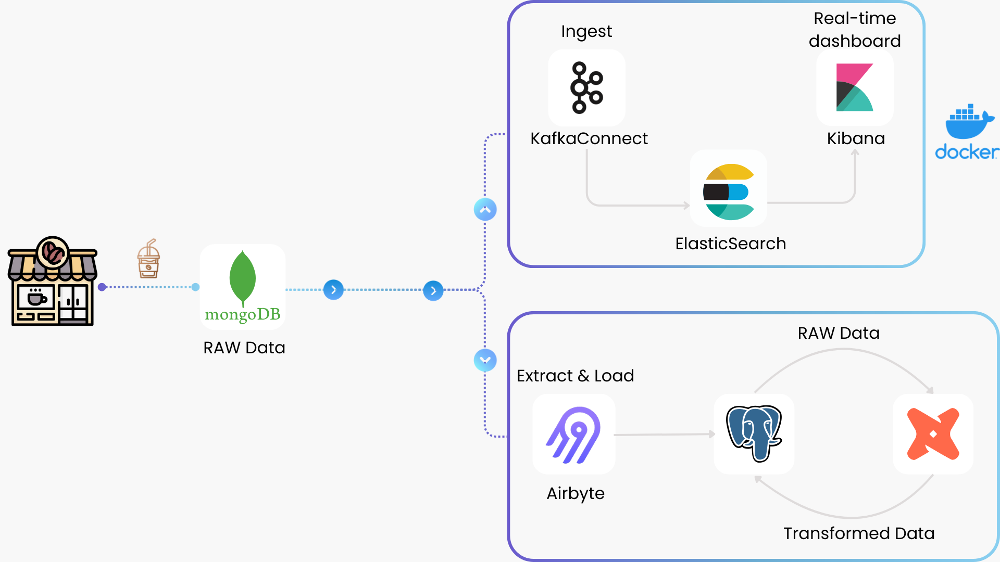

# ***COFFEE SALES HYBRID DATA PIPELINE***
    
## **Overview**
---


## **📕 Table Of Contents**
* [⚙️ Local Setup](#local-setup)
* [⚡ Streaming Pipeline](#streaming-pipeline)
* [⏳ Batch Pipeline](#batch-pipeline)
* [📝 Documentation](index.md)
---

## **⚙️ Local Setup**

### 1. Prerequisites
- <p>Install <a href="https://www.docker.com/products/docker-desktop/" target="_blank">Docker</a>.</p>
- <p>Install <a href="https://www.python.org/" target="_blank">Python</a>.</p>
- <p>Install <a href="https://www.postgresql.org/download/" target="_blank">PostgreSQL</a>.</p>
- <p>Install <a href="https://www.mongodb.com/docs/manual/administration/install-community/" target="_blank">self-hosted MongoDB</a> or <a href="https://www.mongodb.com/atlas" target="_blank">MongoDB in Cloud</a>.</p>
- <p>Create an <a href="https://www.cloud.airbyte.com/" target="_blank">Airbyte account</a>.</p>
- Clone, fork, or download this GitHub repository on your local machine using the following command:
```bash
git clone https://github.com/lnynhi02/coffee-sales-data-pipeline.git
```

### 2. Project Structure
```
coffee-sales-data-pipeline/
├── connectors/                  # Kafka Connect configuration files
│   ├── elasticsearch-sink-connector.json  # Sink connector for Elasticsearch
│   ├── generate-mongo-connector.py        # Script to create MongoDB source connector
├── dbt-project/                 # DBT project for data transformation
│   ├── coffee_dw/               # Data warehouse managed by DBT
│   │   ├── seeds/               # Static seed data
│   │   │   ├── payment_method/  # Payment method details (CSV, schema)
│   │   │   ├── product/         # Product details & categories (CSV, schema)
│   │   │   ├── store/           # Store details (CSV, schema)
│   │   ├── models/              # DBT models
│   │   │   ├── staging/         # Load raw data from PostgreSQL
│   │   │   ├── marts/           # Transformed data models
│   │   │   │   ├── dimensions/  # Product, store, payment_method
│   │   │   │   ├── facts/       # Sales data
│   ├── dbt_project.yml          # DBT project config
│   ├── packages.yml             # DBT dependencies
│   ├── profiles.yml             # DBT database connection config
├── scripts/
│   └── mongodb_data.py           # Streams data to MongoDB
├── docker-compose.yml            # Docker Compose for service orchestration
├── config.ini                    # MongoDB connection details
└── run-pipeline.ps1              # Script to run the pipeline
```

---

1. Create a virtual environment:
   ```sh
   python -m venv venv
   ```
2. Activate the virtual environment:
      - **Windows PowerShell:**
      ```sh
      venv\Scripts\Activate
      ```
      - **Linux/macOS:**
      ```sh
      source venv/bin/activate
      ```
3. Install the necessary package:
   ```sh
   pip install pymongo
   ```
---

## **⚡ Streaming Pipeline**
Visit [this](streaming.md) for more details.

## **⏳ Batch Pipeline**
Visit [this](batch.md) for more details.

## **📝 Documentation**
Visit [this](index.md) for more details.
