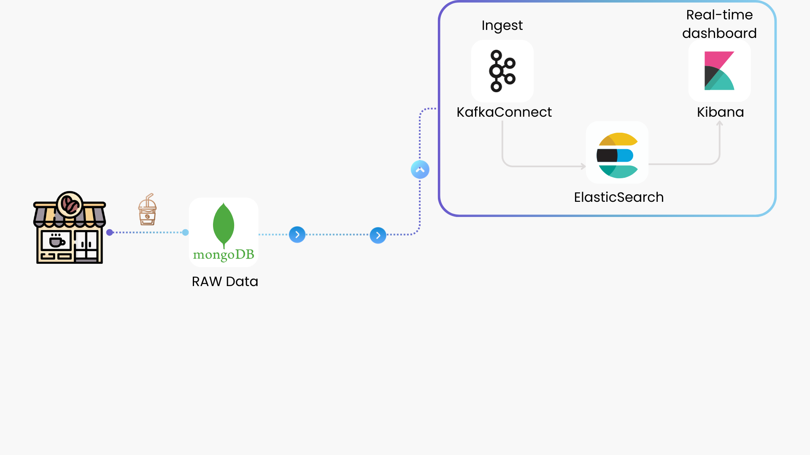
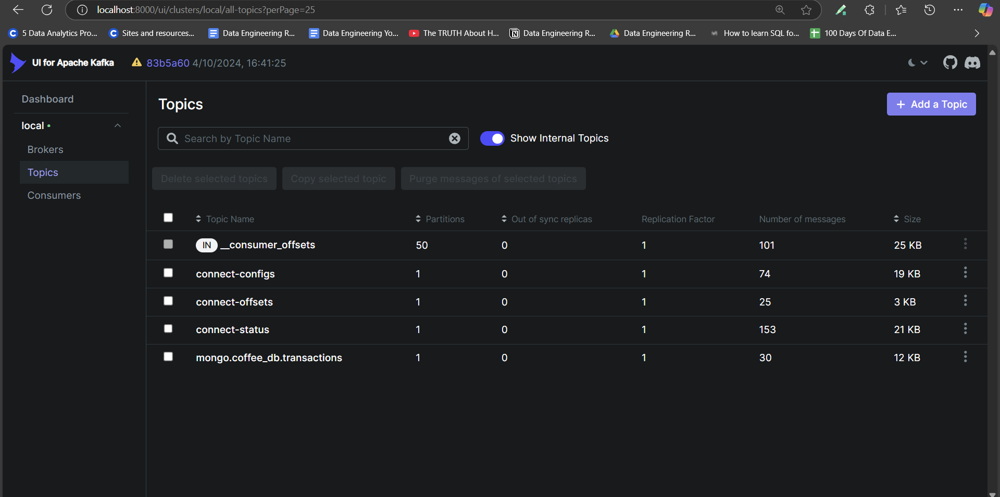
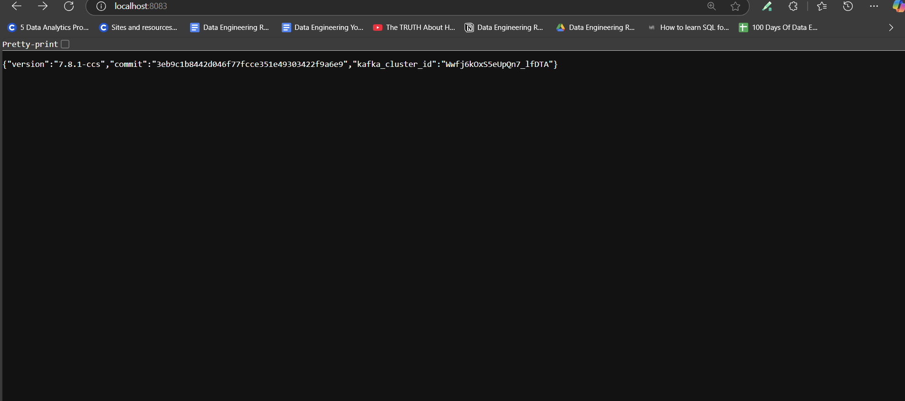
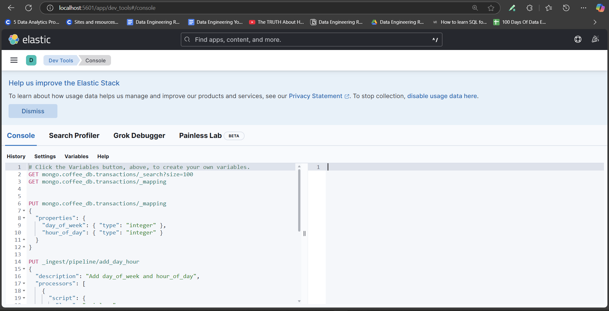
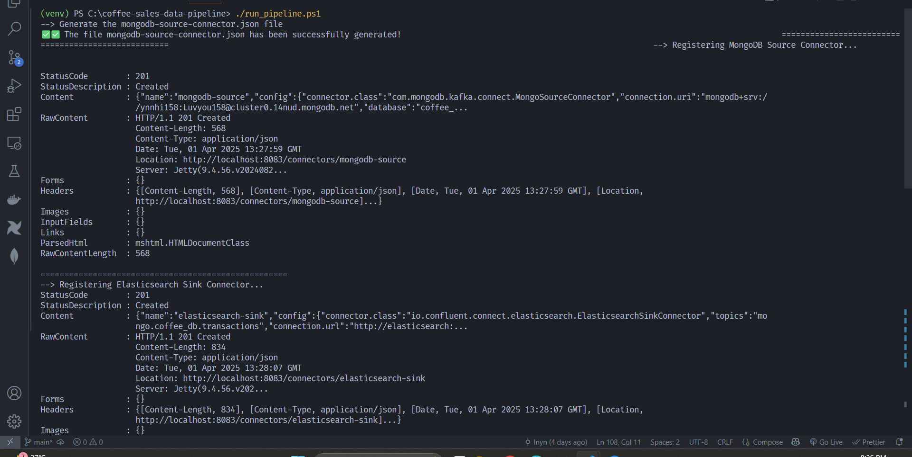

# ***⚡ Streaming Pipeline***

<br>

## 1. Configure MongoDB connection
You need to complete the setup in the [Prerequisites](overview.md#local-setup) section before proceeding.

Set up your `config.ini` file with the necessary credentials to connect to your MongoDB database:
```py
config = configparser.ConfigParser()
config.read("config.ini")

# Connect to MongoDB
username = config["mongo"]["username"]
password = config["mongo"]["password"]
cluster = config["mongo"]["cluster"]
database = config["mongo"]["database"]

uri = f"mongodb+srv://{username}:{password}@{cluster}"
client = MongoClient(uri)
db = client[database]
```

## 2. Setup Kafka Connect
To set up Kafka Connect, we first need to configure the Kafka Broker and Kafka UI as follows:

### Kafka Broker
All Kafka container-related data will be stored in `docker_volumes/kafka`
```py
kafka:
    container_name: kafka
    image: 'bitnami/kafka:latest'
    user: root
    ports:
      - '9094:9094'
    networks:
      - myNetwork
    environment:
      - KAFKA_CFG_NODE_ID=0
      - KAFKA_CFG_PROCESS_ROLES=controller,broker
      - KAFKA_CFG_LISTENERS=PLAINTEXT://:9092,CONTROLLER://:9093,EXTERNAL://:9094
      - KAFKA_CFG_ADVERTISED_LISTENERS=PLAINTEXT://kafka:9092,EXTERNAL://localhost:9094
      - KAFKA_CFG_LISTENER_SECURITY_PROTOCOL_MAP=CONTROLLER:PLAINTEXT,EXTERNAL:PLAINTEXT,PLAINTEXT:PLAINTEXT
      - KAFKA_CFG_CONTROLLER_QUORUM_VOTERS=0@kafka:9093
      - KAFKA_CFG_CONTROLLER_LISTENER_NAMES=CONTROLLER
      - KAFKA_AUTO_CREATE_TOPICS_ENABLE=true
    volumes:
      - ./docker_volumes/kafka:/bitnami/kafka:rw
```
---

### Create Required Topics for Kafka Connect
Kafka Connect requires three topics: `connect-configs`, `connect-offsets`, and `connect-status`.
These topics must be created before starting Kafka Connect, otherwise, the connector will fail to start.

To ensure that the topics are created properly, we set up an `init-kafka` container. This container will wait until **Kafka is fully ready** before creating the required topics.
```py
  init-kafka:
    image: 'bitnami/kafka:latest'
    depends_on:
      - kafka
    networks:
      - myNetwork
    entrypoint: ["/bin/bash", "-c"]
    command: 
      - |
        echo "Waiting for Kafka to be ready..."
        while ! kafka-topics.sh --bootstrap-server kafka:9092 --list; do
          sleep 5
        done

        echo "🚀 Kafka is ready. Creating topics ...... 🚀"
        kafka-topics.sh --create --if-not-exists --bootstrap-server kafka:9092 --partitions 1 --replication-factor 1 --config cleanup.policy=compact  --topic connect-configs
        kafka-topics.sh --create --if-not-exists --bootstrap-server kafka:9092 --partitions 1 --replication-factor 1 --config cleanup.policy=compact  --topic connect-offsets
        kafka-topics.sh --create --if-not-exists --bootstrap-server kafka:9092 --partitions 1 --replication-factor 1 --config cleanup.policy=compact  --topic connect-status

        echo '🚀 Topic created successfully! 🚀'
        kafka-topics.sh --bootstrap-server kafka:9092 --list
```
---

### Kafka UI for Monitoring
To easily monitor Kafka topics and messages, we set up Kafka UI.
```py
  kafka-ui:
    container_name: kafka-ui-1
    image: provectuslabs/kafka-ui:latest
    ports:
      - 8000:8080
    depends_on:
      - kafka
    networks:
      - myNetwork
    environment:
      KAFKA_CLUSTERS_0_NAME: local
      KAFKA_CLUSTERS_0_BOOTSTRAP_SERVERS: PLAINTEXT://kafka:9092
      DYNAMIC_CONFIG_ENABLED: 'true'
```
---

### Kafka Connect Configuration
Finally, we configure Kafka Connect. The `commands` section downloads the required MongoDB and Elasticsearch connector plugins.
```py
connect:
    image: confluentinc/cp-kafka-connect:latest
    hostname: connect
    container_name: connect
    depends_on:
      - kafka
    ports:
      - "8083:8083"
    environment:
      CONNECT_BOOTSTRAP_SERVERS: "kafka:9092"
      CONNECT_REST_ADVERTISED_HOST_NAME: "connect"
      CONNECT_GROUP_ID: "connect-cluster"
      CONNECT_CONFIG_STORAGE_TOPIC: "connect-configs"
      CONNECT_OFFSET_STORAGE_TOPIC: "connect-offsets"
      CONNECT_STATUS_STORAGE_TOPIC: "connect-status"
      CONNECT_KEY_CONVERTER: "org.apache.kafka.connect.json.JsonConverter"
      CONNECT_VALUE_CONVERTER: "org.apache.kafka.connect.json.JsonConverter"
      CONNECT_PLUGIN_PATH: "/usr/share/confluent-hub-components"
    volumes:
      - ./docker_volumes/kafka_connect:/data
    networks:
      - myNetwork
    command:
      - bash
      - -c
      - |
        confluent-hub install --no-prompt mongodb/kafka-connect-mongodb:latest
        confluent-hub install --no-prompt confluentinc/kafka-connect-elasticsearch:latest
        /etc/confluent/docker/run
```
---

## 3. ElasticSearch and Kibana
To ensure that data persists even after restarting the container, we mount the `docker-volumes/elasticsearch_data` folder as a volume for Elasticsearch.
```py
  elasticsearch:
    image: docker.elastic.co/elasticsearch/elasticsearch:8.5.0
    container_name: elasticsearch
    ports:
      - "9200:9200"
    environment:
      - discovery.type=single-node
      - xpack.security.enabled=false
    volumes:
      - ./docker_volumes/elasticsearch_data:/usr/share/elasticsearch/data
    networks:
      - myNetwork
```
---

Kibana is configured to connect to Elasticsearch via the `ELASTICSEARCH_HOSTS` environment variable:
```py
  kibana:
    image: docker.elastic.co/kibana/kibana:8.5.0
    container_name: kibana
    environment:
      - ELASTICSEARCH_HOSTS=http://elasticsearch:9200
    ports:
      - "5601:5601"
    depends_on:
      - elasticsearch
    networks:
      - myNetwork
```
!!! note
      The value of `ELASTICSEARCH_HOSTS` must match the **container name of the Elasticsearch service**.
      In this setup, our Elasticsearch container is named `elasticsearch`, so Kibana should use `http://elasticsearch:9200`.
      If the container name is changed, `ELASTICSEARCH_HOSTS` must be updated accordingly.

---

## 4. Run the Streaming script
Now we can start the necessary containers and begin streaming data to MongoDB and Elasticsearch using the following command:
```bash
docker-compose up -d 
```
<br>
#### Execution Overview 🎬
Before setting up the environment, here’s a quick demo of the streaming pipeline in action:

📽️

{: style='width: 100%'}

---

### Run the Pipeline Script
Instead of running multiple commands manually, we have a PowerShell script `run_pipeline.ps1` that automates the entire process, including:

✔️ Generating connector configuration

✔️ Registering Kafka Connectors

✔️ Checking connector status

The script performs the following tasks:

1. **Generate MongoDB Source Connector Configuration** <br>
```py
Write-Host "--> Generate the mongodb-source-connector.json file"
python connectors/generate-mongo-connector.py 
Write-Host "===================================================="
```
The first step is to generate the `mongodb-source-connector.json` file. This file contains the Kafka Source Connector configuration, which is created by the script `generate-mongo-connector.py` located in the `connectors/` folder. The configuration file will be generated using connection details stored in `config`.ini (such as MongoDB credentials, cluster, database, and collection).
```py
user = config["mongo"]["username"]
password = config["mongo"]["password"]
cluster = config["mongo"]["cluster"]
database = config["mongo"]["database"]
collection = config["mongo"]["collection"]
```
**Note:** The script `generate-mongo-connector.py` reads from `config.ini and creates the `mongodb-source-connector.json` file.<br><br>
Visit the <a href="https://www.mongodb.com/docs/kafka-connector/current/source-connector/configuration-properties/" target="_blank">MongoDB Kafka Connector Configuration Properties</a> to learn more about the attributes or configuration of the MongoDB source connector.

2. **Register MongoDB Source Connector to Kafka Connect** <br>
```py
Start-Sleep -Seconds 5
Write-Host "--> Registering MongoDB Source Connector..."
Invoke-WebRequest -Uri "http://localhost:8083/connectors" -Method Post -ContentType "application/json" -InFile ".\connectors\mongodb-source-connector.json"
Write-Host "===================================================="
```
After generating the configuration, the script registers the MongoDB Source Connector to Kafka Connect.

3. **Register Elasticsearch Sink Connector to Kafka** <br>
```py
Start-Sleep -Seconds 5
Write-Host "--> Registering Elasticsearch Sink Connector..."
Invoke-WebRequest -Uri "http://localhost:8083/connectors" -Method Post -ContentType "application/json" -InFile ".\connectors\elasticsearch-sink-connector.json"
Write-Host "===================================================="
```
Similarly, the script registers the Elasticsearch Sink Connector to Kafka. This connector’s configuration file is also located in the connector folder.<br><br>
Visit the <a href="https://docs.confluent.io/kafka-connectors/elasticsearch/current/configuration_options.html" target="_blank">Elasticsearch Sink Connector Documentation</a> to learn more about the attributes or configuration of the Elasticsearch sink connector.

4. **Generate Data for Testing** <br>
```py
Start-Sleep -Seconds 5
Write-Host "--> Generating data ..."
python scripts/mongodb_data.py
Write-Host "===================================================="
```
The script then runs a small data generation process to simulate real-time data streaming, which helps check if the connectors are working properly.

5. **Check the Status of the Connectors** <br>
```py
Start-Sleep -Seconds 5
Write-Host "--> Checking MongoDB source connector status..."
Invoke-RestMethod -Uri "http://localhost:8083/connectors/mongodb-source/status"
Write-Host "===================================================="

Start-Sleep -Seconds 5
Write-Host "--> Checking Elasticsearch sink connector status..."
Invoke-RestMethod -Uri "http://localhost:8083/connectors/elasticsearch-sink/status"
Write-Host "===================================================="

Write-Host "--> If nothing goes wrong, can manual sync Airbyte https://cloud.airbyte.com/workspaces/6abdf744-0697-44b8-9e50-5ef7cabed21e/connections ..."
```
Finally, the script checks the status of both the MongoDB Source Connector and the Elasticsearch Sink Connector to ensure they are running successfully.
---
Full script in the `run_pipeline.ps1` file.

Once all containers are **ready and healthy**, you can access the following services:

- Kafka UI: `localhost:8000`


- Kafka Connect UI: `localhost:8083`


- Kibana (ElasticSearch UI): `localhost:5601`


Execute the following command to run the entire pipeline setup:
```bash
.\run_pipeline.ps1
```
Once executed, the output should look similar to the following:




---