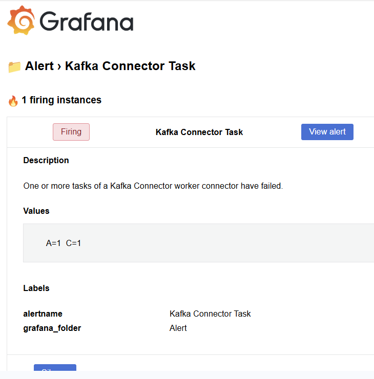

# ***⚡ Streaming Pipeline***

## 1. Configure MySQL connection
You need to complete the setup in the [Prerequisites](overview.md#local-setup) section before proceeding.

Set up your `.env` file with the necessary credentials to connect to your MySQL database:
```py
MSQL_HOST=127.0.0.1
MSQL_USER=root
MSQL_PASSWORD=yourpassword
MSQL_DATABASE=coffee_shop
```

## 2. Setup Kafka
To set up Kafka Connect, we first need to configure the Kafka Broker and Kafka UI as follows:

### Kafka Broker
Two Kafka brokers are configured with data stored in `volumes/kafka-1` and `volumes/kafka-2`. You can scale up (e.g., 3 brokers) if more resources are available.

Since `Prometheus` and `Grafana` are used for monitoring, JMX is also configured for each Kafka broker to export metrics.
```py
  kafka-1:
    container_name: kafka-1
    image: 'bitnami/kafka:3.5.1'
    ports:
      - '29092:29092'
    networks:
      - myNetwork
    environment:
      - KAFKA_CFG_NODE_ID=1
      - KAFKA_CFG_PROCESS_ROLES=controller,broker
      - KAFKA_CFG_LISTENERS=PLAINTEXT://:9092,CONTROLLER://:9093,EXTERNAL://:29092
      - KAFKA_CFG_ADVERTISED_LISTENERS=PLAINTEXT://kafka-1:9092,EXTERNAL://localhost:29092
      - KAFKA_CFG_LISTENER_SECURITY_PROTOCOL_MAP=CONTROLLER:PLAINTEXT,EXTERNAL:PLAINTEXT,PLAINTEXT:PLAINTEXT
      - KAFKA_CFG_CONTROLLER_QUORUM_VOTERS=1@kafka-1:9093,2@kafka-2:9093
      - KAFKA_CFG_CONTROLLER_LISTENER_NAMES=CONTROLLER
      - KAFKA_AUTO_CREATE_TOPICS_ENABLE=true
      - KAFKA_KRAFT_CLUSTER_ID=k3Fk2HhXQwWL9rPlYxYOoA
      - KAFKA_OPTS=-javaagent:/usr/share/jmx-exporter/jmx_prometheus_javaagent-0.20.0.jar=9300:/usr/share/jmx-exporter/kafka-broker.yml
    volumes:
      - ./volumes/kafka-1:/bitnami/kafka
      - ./volumes/jmx-exporter:/usr/share/jmx-exporter

  kafka-2:
    container_name: kafka-2
    image: 'bitnami/kafka:3.5.1'
    ports:
      - "29093:29093"
    environment:
      - KAFKA_CFG_NODE_ID=2
      - KAFKA_CFG_PROCESS_ROLES=controller,broker
      - KAFKA_CFG_LISTENERS=PLAINTEXT://:9092,CONTROLLER://:9093,EXTERNAL://:29093
      - KAFKA_CFG_ADVERTISED_LISTENERS=PLAINTEXT://kafka-2:9092,EXTERNAL://localhost:29093
      - KAFKA_CFG_LISTENER_SECURITY_PROTOCOL_MAP=CONTROLLER:PLAINTEXT,EXTERNAL:PLAINTEXT,PLAINTEXT:PLAINTEXT
      - KAFKA_CFG_CONTROLLER_QUORUM_VOTERS=1@kafka-1:9093,2@kafka-2:9093
      - KAFKA_CFG_CONTROLLER_LISTENER_NAMES=CONTROLLER
      - KAFKA_AUTO_CREATE_TOPICS_ENABLE=true
      - KAFKA_KRAFT_CLUSTER_ID=k3Fk2HhXQwWL9rPlYxYOoA
      - KAFKA_OPTS=-javaagent:/usr/share/jmx-exporter/jmx_prometheus_javaagent-0.20.0.jar=9300:/usr/share/jmx-exporter/kafka-broker.yml
    volumes:
      - ./volumes/kafka-2:/bitnami/kafka
      - ./volumes/jmx-exporter:/usr/share/jmx-exporter
    networks:
      - myNetwork
```
---

### Create Required Topics for Kafka Connect
Kafka Connect requires three topics: `connect-configs`, `connect-offsets`, and `connect-status`.
These topics must be created before starting Kafka Connect, otherwise, the connector will fail to start.

Additionally, we also pre-create the topic `mysql.coffee-shop.order_details`, which is the destination topic where Kafka Connect pushes CDC (Change Data Capture) events from the `order_details` table in MySQL.

To ensure that the topics are created properly, we set up an `init-kafka` container. This container will wait until **Kafka is fully ready** before creating the required topics.
```py
init-kafka:
  image: 'bitnami/kafka:3.5.1'
  container_name: init-kafka
  depends_on:
    - kafka-1
    - kafka-2
  networks:
    - myNetwork
  entrypoint: ["/bin/bash", "-c"]
  command: 
    - |
      echo "Waiting for Kafka to be ready..."
      while ! kafka-topics.sh --bootstrap-server kafka-1:9092 --list; do
        sleep 5
      done

      echo "🚀 Kafka is ready. Creating topics ...... 🚀"
      kafka-topics.sh --create --if-not-exists --bootstrap-server kafka-1:9092 --partitions 1 --replication-factor 1 --config cleanup.policy=compact  --topic connect-configs
      kafka-topics.sh --create --if-not-exists --bootstrap-server kafka-1:9092 --partitions 10 --replication-factor 2 --config cleanup.policy=compact  --topic connect-offsets
      kafka-topics.sh --create --if-not-exists --bootstrap-server kafka-1:9092 --partitions 5 --replication-factor 2 --config cleanup.policy=compact  --topic connect-status
      kafka-topics.sh --create --if-not-exists --bootstrap-server kafka-1:9092 --partitions 3 --replication-factor 2 --topic mysql.coffee_shop.order_details
      kafka-topics.sh --create --if-not-exists --bootstrap-server kafka-1:9092 --partitions 2 --replication-factor 2 --topic mysql.coffee_shop.orders
      kafka-topics.sh --create --if-not-exists --bootstrap-server kafka-1:9092 --partitions 2 --replication-factor 2 --topic order_ready_for_checking

      echo '🚀 Topic created successfully! 🚀'
      kafka-topics.sh --bootstrap-server kafka-1:9092 --list
```

!!! info
    We chose **2 partitions and 2 replication factor** for most topics based on our system's current load and hardware limitations.

    - **Throughput:**  
      With an average rate of ~17 messages per second (i.e., 1000+ messages per minute), even **1 partition** could technically handle the load. However, because messages are keyed by `order_id` and some orders contain multiple products, there's a risk of **data skew**. Using **3 partitions** for `mysql.coffee_shop.order_details` helps **distribute the load more evenly**.

    - **Replication:**  
      Best practice recommends:
        - **3 brokers**
        - **3 replication factor**
        - **`min.insync.replicas` = 2**  
      This setup ensures **fault tolerance** and **data durability**.

      👉 However, due to local machine constraints, I use only **2 brokers** and **replication factor = 2**, which still offers **basic redundancy**. It's **not ideal to use a single broker** in a streaming system because we need **accurate and consistent data** to execute real-time business logic. If that single broker goes down, the entire system would fail, potentially causing critical disruptions or financial loss.

---

### Kafka Connect Configuration
Finally, we configure Kafka Connect. The `commands` section downloads the required MongoDB and Elasticsearch connector plugins.
```py
  connect:
    image: confluentinc/cp-kafka-connect:latest
    hostname: connect
    container_name: kafka-connect
    depends_on:
      - kafka-1
      - kafka-2
    ports:
      - "8083:8083"
    environment:
      CONNECT_BOOTSTRAP_SERVERS: "kafka-1:9092,kafka-2:9092"
      CONNECT_REST_ADVERTISED_HOST_NAME: "connect"
      CONNECT_GROUP_ID: "connect-cluster"
      CONNECT_CONFIG_STORAGE_TOPIC: "connect-configs"
      CONNECT_OFFSET_STORAGE_TOPIC: "connect-offsets"
      CONNECT_STATUS_STORAGE_TOPIC: "connect-status"
      CONNECT_KEY_CONVERTER: "org.apache.kafka.connect.json.JsonConverter"
      CONNECT_VALUE_CONVERTER: "org.apache.kafka.connect.json.JsonConverter"
      CONNECT_PLUGIN_PATH: "/usr/share/confluent-hub-components"
      KAFKA_JMX_OPTS: -javaagent:/usr/share/jmx-exporter/jmx_prometheus_javaagent-0.20.0.jar=9300:/usr/share/jmx-exporter/kafka-connect.yml
    command:
      - bash
      - -c
      - |
          if [ ! -d "/usr/share/confluent-hub-components/debezium-debezium-connector-mysql" ]; then
            confluent-hub install --no-prompt debezium/debezium-connector-mysql:latest
          fi
          /etc/confluent/docker/run
    volumes:
      - ./volumes/jmx-exporter:/usr/share/jmx-exporter/
      - ./volumes/connector-plugins:/plugins
    restart: always
    networks:
      - myNetwork
```
---

## 3. Redis
Since real-time business logic is implemented (visit [here](index.md#1-project-overview) for more details), the system needs to access data from the database for processing. To reduce load and improve performance, Redis is used to cache data that is frequently accessed but infrequently updated, minimizing database queries.
```py
  redis:
    image: redis/redis-stack:latest
    container_name: redis
    ports:
      - "6379:6379"
      - "8001:8001"
    volumes:
      - ./volumes/redis:/data
    depends_on:
      - kafka-1
      - kafka-2 
    networks:
      - myNetwork
```
---

## 4. Prometheus and Grafana
Prometheus and Grafana are used to monitor Kafka, gather Kafka metrics, and trigger alerts when errors occur.

You must configure the following environment variables in the `.env` file to enable email alerts in Grafana:

```
SMTP_USER=your_email@example.com
SMTP_PASSWORD=your_email_app_password
SMTP_FROM_ADDRESS=alert_sender@example.com
```
!!!note
    This is an **app password**, not your Gmail account password.
    Visit <a href="https://support.google.com/mail/answer/185833?hl=en" target="_blank">this guide</a> for more details.

```py
  prometheus:
    image: prom/prometheus:v2.50.0
    container_name: prometheus
    ports:
      - "9090:9090"
    volumes:
      - ./volumes/monitoring/prometheus.yml:/etc/prometheus/prometheus.yml
    networks:
      - myNetwork

  grafana:
    image: grafana/grafana:latest
    container_name: grafana
    ports:
      - "3000:3000"
    environment:
      - GF_SMTP_ENABLED=true
      - GF_SMTP_HOST=smtp.gmail.com:587
      - GF_SMTP_USER=${SMTP_USER}
      - GF_SMTP_PASSWORD=${SMTP_PASSWORD}
      - GF_SMTP_FROM_ADDRESS=${SMTP_FROM_ADDRESS}
      - GF_SMTP_FROM_NAME=Grafana Alerts
    volumes:
      - ./volumes/grafana/data:/var/lib/grafana
      - ./volumes/monitoring/grafana/provisioning:/etc/grafana/provisioning
    depends_on:
      - prometheus
      - kafka-1
      - kafka-2
    networks:
      - myNetwork
```

---

## 5. Run the Streaming script
#### Execution Overview 🎬
Before setting up the environment, here’s a quick demo of the streaming pipeline in action:<br>
📽️
{: style='width: 100%'}

#### Run the Real-time Pipeline

##### 1. Start Required Containers

First, bring up all necessary containers for real-time streaming:

```powershell
docker-compose -f docker-compose-realtime.yaml up -d
```

##### 2. Prepare Real-time Prerequisites
Before starting the data pipeline, make sure the following prerequisites are met:

###### 2.1. Enable `local_infile` on MySQL
This allows loading static data files using `LOAD DATA LOCAL INFILE`:

```sql
SET GLOBAL local_infile = 1;
```

###### 2.2. Enable MySQL Binary Logging (binlog)

Follow the instructions <a href="https://debezium.io/documentation/reference/stable/connectors/mysql.html#setting-up-mysql" target="_blank">here</a> to create the required user and enable the binlog.
`mysql-src-connector.json`.
!!! note
    If you use a different username or password, make sure to update the following configuration in the `mysql-src-connector.json` file accordingly:
    ```
    "database.user": "dbz-user",
    "database.password": "dbz-user",
    ```
---
    
Instead of running multiple commands manually, we have a PowerShell script `./setup-realtime-prerequisites.ps1` that automates the prerequisite setup, including:

✔️ Creating necessary tables in MySQL

✔️ Loading static file into the tables

✔️ Caching lookup data for later use

✔️ Registering the MySQL source connector

1. **Creating necessary tables in MySQL** <br>
The first step is to create all the tables required for this project.
```powershell
# Run the script to create necessary tables in the MySQL database
python scripts/database/create_table.py
Write-Host "============================================================"
```

2. **Loading static file into the tables** <br>
Load CSV files located in the `data/` folder into corresponding MySQL tables (e.g., stores, products, ...).
```powershell
# Load static reference data (e.g., products, stores) into the database
python scripts/database/load_static_file.py
Write-Host "============================================================"
```

3. **Caching lookup data** <br>
Cache frequently accessed reference data to Redis for faster response and reduced database queries.
```powershell
# Populate Redis cache with referential data for faster lookups
python scripts/database/lookup_data_cache.py
Write-Host "============================================================"
```

4. **Registering MySQL Source Connector to Kafka Connect** <br>
Register the MySQL source connector using the `mysql-src-connector.json` file. This file contains the Kafka Source Connector configuration.
```powershell
# Register the MySQL source connector to Kafka Connect for capturing change data (CDC)
Invoke-WebRequest -Uri "http://localhost:8083/connectors" -Method Post -ContentType "application/json" -InFile "./scripts/real-time/mysql-src-connector.json"
Write-Host "============================================================"
```
Refer to <a href="https://debezium.io/documentation/reference/stable/connectors/mysql.html" target="_blank">MySQL Kafka Connector Configuration Properties</a> for more details.

!!! note
    The number of Kafka consumers should be **less than or equal** to the number of partitions to ensure proper parallel processing.<br>
    You can increase or decrease the number of partitions and update the `num_workers` value accordingly (e.g., `num_workers=3` means 3 parallel consumer processes).
    ```py
    def main() -> None:
    num_workers = 3
    processes = []

    for i in range(num_workers):
        p = multiprocessing.Process(target=consumer_worker, args=(i,))
        p.start()
        processes.append(p)

    for p in processes:
        p.join()
    ```
---

##### 3. Run the Pipeline

Once all containers are **ready and healthy**, and the prerequisites are configured, you can:

- Access services:
    - Kafka UI: <a href="http://localhost:8000" target="_blank">localhost:8000</a>
    - Kafka Connect UI: <a href="http://localhost:8083" target="_blank">localhost:8083</a>

- Launch consumer workers:
```powershell
python scripts/real-time/order_consumer.py
python scripts/real-time/order_details_consumer.py
python scripts/real-time/check_and_recommendation.py
```

- Then, start sending data into the system:
```powershell
python scripts/database/generate_data.py
```

!!! note
    Each script includes a comment header that explains what it does and why it’s used. Feel free to check them out.
You can view the demo in the [Execution Overview](streaming.md#execution-overview).

---

#### Monitor & Alert
- Prometheus: <a href="http://localhost:9090" target="_blank">localhost:9090</a>
- Grafana: <a href="http://localhost:3000" target="_blank">localhost:3000</a>

If an alert condition is triggered (e.g., a Kafka broker goes down or a Kafka Connect task fails), an email notification will be sent as shown below:



---